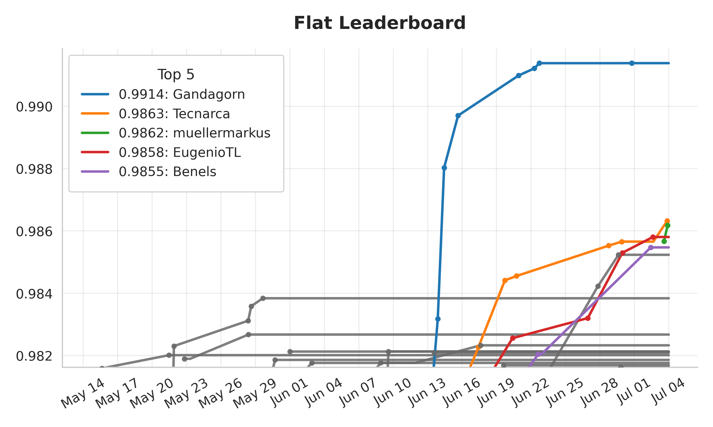
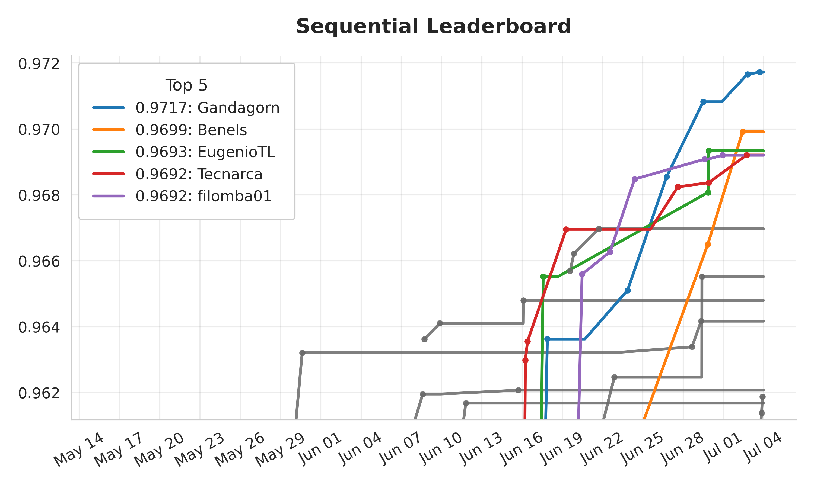
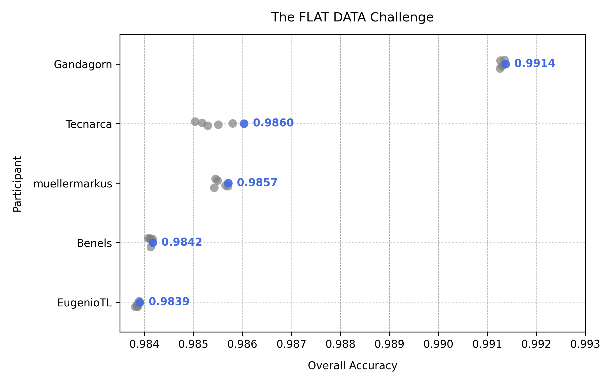
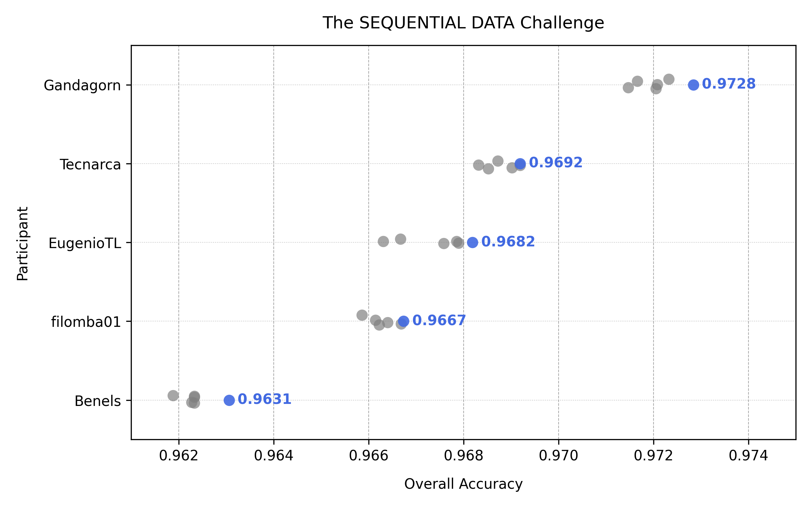
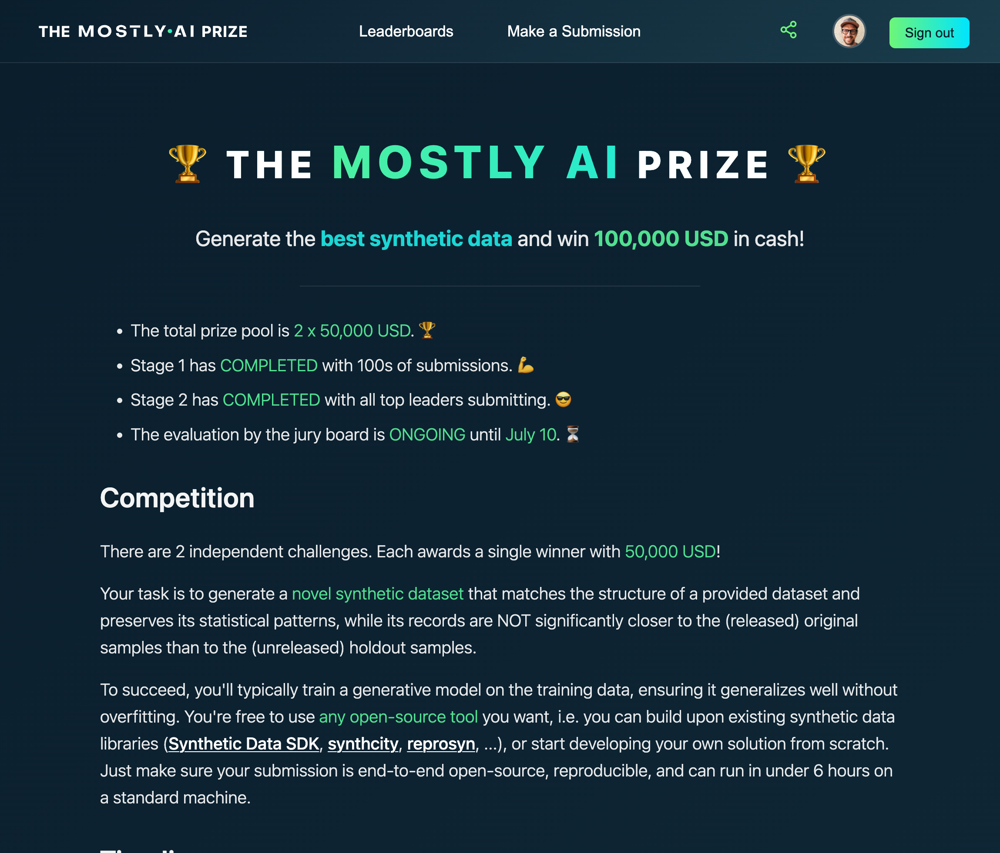

# 🏆 THE MOSTLY AI PRIZE 🏆

The official repository of the [MOSTLY AI](https://mostly.ai/) prize, a **2x $50,000 Synthetic Data competition** from May to July '25.

| Challenge                   | Dataset Details                                                                                          | Stage 1                                                                                                   | Stage 2                                                                                                   |
|----------------------------|-----------------------------------------------------------------------------------------------------------|----------------------------------------------------------------------------------------------------------------|----------------------------------------------------------------------------------------------------------------|
| **The FLAT DATA Challenge** | - 100,000 records  - 80 data columns  - 60 numeric, 20 categorical                                        | - [Training Data](flat/stage1/flat-training.csv.gz)  - [Holdout Data](flat/stage1/flat-holdout.csv.gz) .             | - [Training Data](flat/stage2/flat-training.csv.gz)  - [Holdout Data](flat/stage2/flat-holdout.csv.gz)  - [Evaluation Runs](flat/stage2/submissions/)  |
| **The SEQUENTIAL DATA Challenge** | - 20,000 groups  - 5–10 records each  - 10 data columns  - 7 numeric, 3 categorical                        | - [Training Data](sequential/stage1/sequential-training.csv.gz)  - [Holdout Data](sequential/stage1/sequential-holdout.csv.gz) . | - [Training Data](sequential/stage2/sequential-training.csv.gz)  - [Holdout Data](sequential/stage2/sequential-holdout.csv.gz)  - [Evaluation Runs](sequential/stage2/submissions/)              |

A BIG thank you to all participants for pushing the boundaries of synthetic data further, and acchieving new **state-of-the-art accuracy** for large scale synthetic datasets with open-source solutions! ⭐ 

And a HUGE congratulations to [Gandagorn](https://github.com/Gandagorn) 🥇 for winning the total prize of $100,000! 🎉

## Stage 1

During stage 1 anyone with a GitHub account was invited to participate. All submissions were automatically evaluated via the [Synthetic Data Quality Assurance](https://github.com/mostly-ai/mostlyai-qa) toolkit. All results can be found here: [stage1-results.csv](./stage1-results.csv).

| FLAT                   |  SEQUENTIAL    |
|------------------------|----------------|
|  |  |

## Stage 2

During stage 2 the top 5 leaders of stage 1 were invited to submit their code submissions, which were then evaluated on a slightly modified version of the stage 1 datasets. With the support of a fantastic jury board of renowned synthetic data experts ([@suhaskowshik](https://github.com/suhaskowshik), [@adivekar-utexas](https://github.com/adivekar-utexas), [@shree-gade](https://github.com/shree-gade), [@mplatzer](https://github.com/mplatzer), [@scriminaci](https://github.com/scriminaci), [@psitronic](https://github.com/psitronic)), these code submissions were then run on dedicated GPU instances a total of 6 times each. The generated synthetic data was captured, and then again evaluated with the same metrics as for Stage 1. All results can be found here: [stage2-results.csv](./stage2-results.csv).

| FLAT                   |  SEQUENTIAL    |
|------------------------|----------------|
|  |  |
| **Code Sumissions** - [Gandagorn / mostlyai_flat](https://github.com/Gandagorn/mostlyai_flat) - [Tecnarca / mostlyai-engine-prize](https://github.com/Tecnarca/mostlyai-engine-prize) - [muellermarkus / mostly_ai_prize](https://github.com/muellermarkus/mostly_ai_prize) - [Benels / MostlyAI-challenge-submission-Benels](https://github.com/Benels/MostlyAI-challenge-submission-Benels) - [EugenioTL / mostlyai-engine-custom](https://github.com/EugenioTL/mostlyai-engine-custom) | **Code Sumissions** - [Gandagorn / mostlyai_seq](https://github.com/Gandagorn/mostlyai_seq) - [Tecnarca / mostlyai-engine-prize](https://github.com/Tecnarca/mostlyai-engine-prize) - [EugenioTL / mostlyai-engine-custom](https://github.com/EugenioTL/mostlyai-engine-custom) - [filomba01 / mostly-ai-competition](https://github.com/filomba01/mostly-ai-competition) - [Benels / MostlyAI-challenge-submission-Benels](https://github.com/Benels/MostlyAI-challenge-submission-Benels) |

## Competition Website

